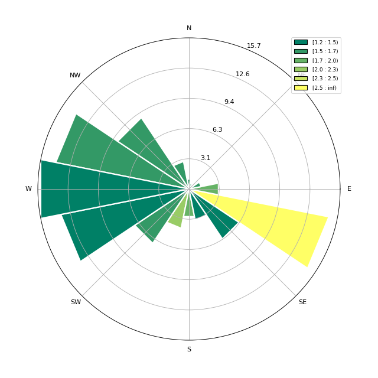
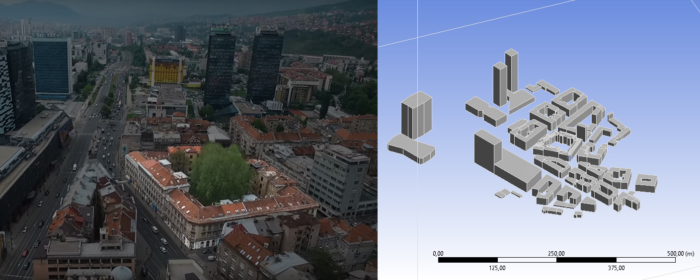
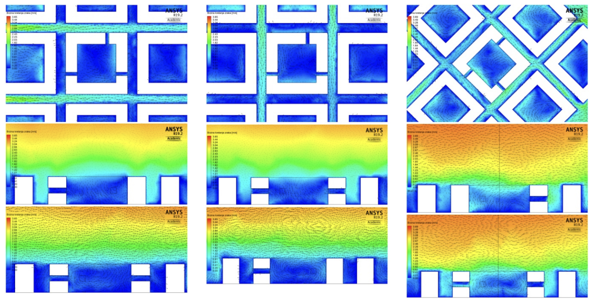
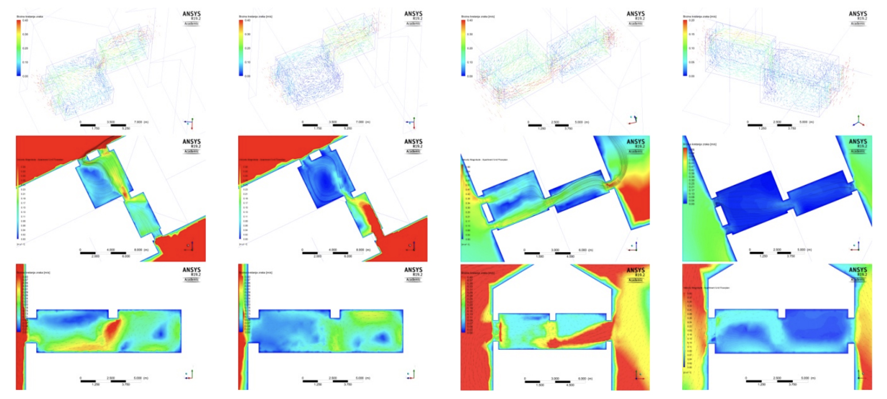
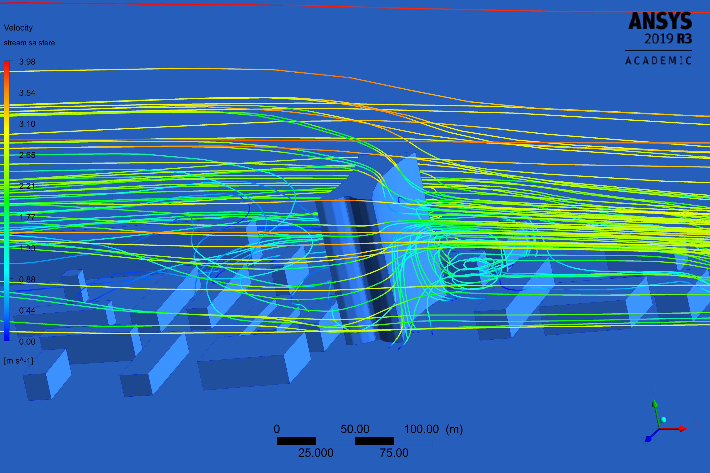
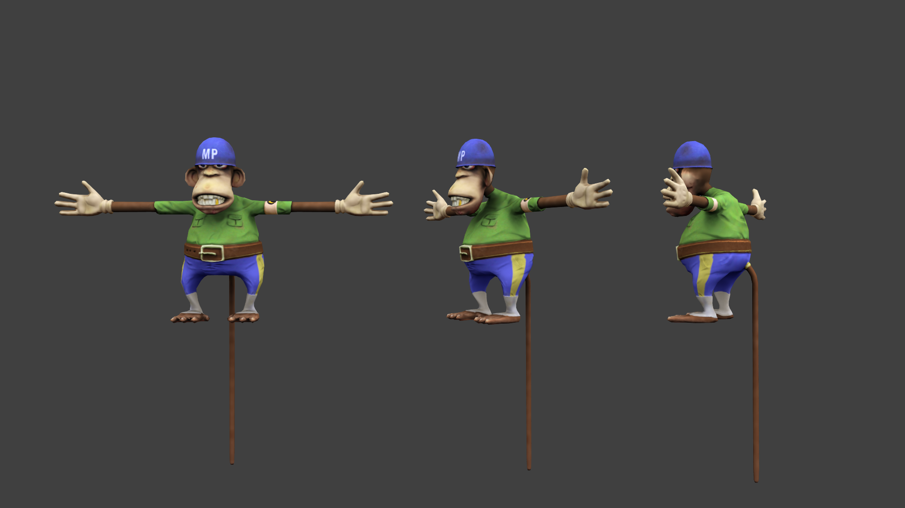
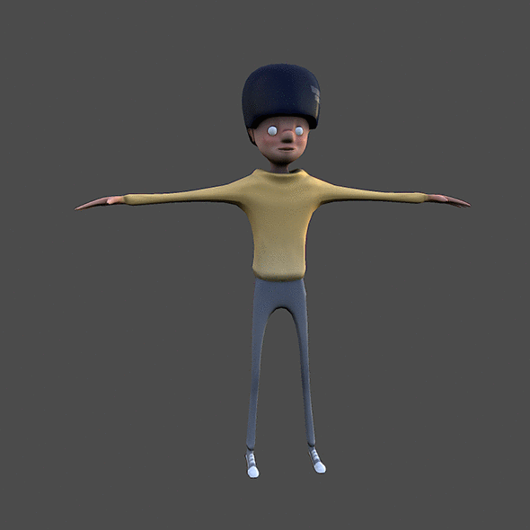

# Portfolio
#### Dženis Avdić
Summary for **ETH** *Zurich*

### 1 :: DATA MINING :: WEB SCRAPING

-	Created a [script][4] that runs locally to read and store available weather data in CSV format
-	[Data obtained][5] from Federal Hydrometeorological Institute for Sarajevo, Bosnia and Herzegovina
-	Windrose plot is being updated with every new value and stored as PNG image
-	CSV data is used for analysis of daytime winds in Sarajevo for specific periods

[4]: https://github.com/DzenisAvdic/Portfolio/blob/main/images/background_process.py
[5]: https://github.com/DzenisAvdic/Portfolio/blob/main/images/hmz_sarajevo.csv

*Sarajevo windrose based on dataset collected from september 2020 to september 2021*

### 2 :: DATA MINING :: SENSOR LOGGER AND WEB API DATA

-	[Data logger][1] is made with open electronics components to collect data inside observed architectural spaces
-	15-minute logs are being stored to microSD card in CSV format for later analyses
-	Available meteorological and air quality data from web APIs is being stored simultaneously
-	Long term monitoring and data collecting for scientific research in building physics and energy efficiency

[1]: https://github.com/DzenisAvdic/Air-Quality-and-Meteorology-Data-Logger

### 3 :: DATA PREPROCESSING AND OBSERVATIONS

-	Based on [collected data][2] specific analyses were conducted
-	Missing values and sensor misreadings were recognised and filled in with neighbouring values average
-	Physical phenomena were analysed for wind movement, natural ventilation and infiltration

*Infiltration air change rate based on collected CO2 concentration level data - Python plot*

[2]: https://github.com/DzenisAvdic/Air-Quality-and-Meteorology-Data-Logger/blob/main/Journal%20of%20Pervasive%20Technology%20reference%20files/preprocessed_data_15_weeks.csv

### 4 :: DATA VERIFICATION AND VALIDATION USING CFD SIMULATIONS

-	2D and 3D CFD simulations were conducted for typologicaly specific building form

*Building block with courtyard typology*

*Street corridor ventilation and apartments' air change rate estimation*

-	Based on real data (weather stations data), natural ventilation potential was estimated for neighbourhood (urban area ventilation) and single apartment (interior ventilation air flow)

*'Marijin dvor' building air change rate simulations*

-	Pedestrian and street level air movement phenomena was analysed for arguably misplaced high rise building in Sarajevo area

*Air movement around building simulation for Sarajevo Tower*

### 5 :: MACHINE LEARNING :: TIME SERIES FORECASTING

-	Tensorflow Recurrent Neural Network (RNN) with Gated Recurrent Units (GRUs) for time series forecasting was deployed to Arduino Nano 33 BLE Sense using TinyML

*TinyML time series forecasting deployed on Arduino*

-	Three different prediction algorithms were discussed and compared (ARIMA, facebook Prophet and Tensorflow RNN)

*Accuracy of compared ML models for air moisture content*

-	Low-energy consumption [AI assisted system is proposed][3] for natural ventilation control and predictive maintenance ([full paper][4])

[3]: https://github.com/DzenisAvdic/Air-Quality-and-Meteorology-Data-Logger/tree/main/Journal%20of%20Pervasive%20Technology%20reference%20files
[4]: http://ojs.sozu.us/ojs/index.php/jopt/article/view/6

### 6 :: LOW-POLY 3D MODELING :: OPTIMIZATION FOR UNITY AND UNREAL ENGINE

-	Worflow includes various software for 3D modeling, retoplogy and texturing
-	Optimization of highly detailed 3D models for web and UI/UX integration

*Game 3D models optimized with low polygon count for mobile gaming implementation*

*Preview of low-poly 3D model, ready for implementation in any 3D game development engine*

*Animated preview*

## THANK YOU FOR YOUR TIME
### DŽENIS AVDIĆ
#### dzenis.avdic@gmail.com

